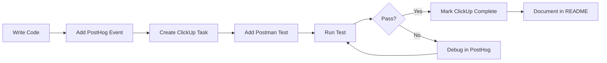

# PostHog + ClickUp + Postman Integration Guide

**Last Updated:** February 8, 2026  
**Organization:** Third Eye Cyborg LLC  
**Project:** Ascended Social

---

## Table of Contents
1. [Overview](#overview)
2. [PostHog Setup](#posthog-setup)
3. [Environment Configuration](#environment-configuration)
4. [ClickUp Integration](#clickup-integration)
5. [Postman API Testing](#postman-api-testing)
6. [Event Tracking Schema](#event-tracking-schema)
7. [Privacy & Compliance](#privacy--compliance)
8. [Troubleshooting](#troubleshooting)

---

## Overview

This guide explains how to integrate PostHog analytics with ClickUp project management and Postman API testing for the Ascended Social platform.

### Architecture

```
┌─────────────────────────────────────────────────────────────┐
│                    Ascended Social                          │
│  ┌──────────────┐    ┌──────────────┐    ┌──────────────┐ │
│  │   Frontend   │───▶│   PostHog    │◀───│   Backend    │ │
│  │  (React +    │    │  Analytics   │    │  (Express +  │ │
│  │   Vite)      │    │              │    │   Node.js)   │ │
│  └──────────────┘    └───────┬──────┘    └──────────────┘ │
└────────────────────────────┬─│─────────────────────────────┘
                             │ │
              ┌──────────────┘ └──────────────┐
              ▼                                ▼
    ┌─────────────────┐              ┌─────────────────┐
    │     ClickUp     │              │    Postman      │
    │ Project Tracking│              │  API Testing    │
    │  & Task Mgmt    │              │  & Monitoring   │
    └─────────────────┘              └─────────────────┘
```

### Key Components

- **PostHog Project ID:** 122488
- **Organization:** Third Eye Cyborg (0194b522-eca9-0000-1bd4-87f3c600a8d4)
- **API Token:** `phc_69GDi6zFcLWK7zOrZ3kf4uBSKYLvB5ZVChi1advEFIB`
- **Host:** https://app.posthog.com

---

## PostHog Setup

### 1. Project Configuration

**Current Setup:**
- **Project Name:** Ascended Social
- **Project ID:** 122488
- **Organization:** Third Eye Cyborg
- **Status:** ✅ Configured and Integrated

### 2. Client-Side Integration

PostHog is initialized in [client/src/lib/analytics.ts](../../client/src/lib/analytics.ts) with privacy-first settings:

```typescript
import posthog from 'posthog-js';

posthog.init(VITE_POSTHOG_API_KEY, {
  api_host: 'https://app.posthog.com',
  
  // Privacy-first configuration
  autocapture: false,           // Requires consent
  capture_pageview: false,      // Requires consent
  disable_session_recording: true,
  respect_dnt: true,
  opt_out_capturing_by_default: true,
  
  // Session recording privacy
  session_recording: {
    maskAllInputs: true,
    maskInputOptions: {
      password: true,
      email: true,
      tel: true,
    },
    maskTextSelector: '.sensitive, .private, .pii',
    blockClass: 'ph-no-capture',
  },
  
  // Data sanitization
  sanitize_properties: (properties) => {
    // Remove PII automatically
    delete properties.$ip;
    delete properties.$geoip_city_name;
    return properties;
  }
});
```

### 3. Server-Side Tracking

Server-side analytics in [server/analytics.ts](../../server/analytics.ts):

```typescript
import { PostHog } from 'posthog-node';

const posthogServer = new PostHog(
  process.env.POSTHOG_API_KEY,
  {
    host: process.env.POSTHOG_HOST,
    flushAt: 20,
    flushInterval: 30000,
    disableGeoip: process.env.NODE_ENV === 'development',
  }
);

// Track server events
AnalyticsService.track({
  event: 'user_registered',
  distinctId: userId,
  properties: {
    chakraType: user.primaryChakra,
    energyLevel: user.energyPoints,
  }
});
```

---

## Environment Configuration

### Required Environment Variables

Add these to **Replit Secrets** (or `.env.local` for local development):

```bash
# PostHog Analytics
POSTHOG_API_KEY=phc_69GDi6zFcLWK7zOrZ3kf4uBSKYLvB5ZVChi1advEFIB
POSTHOG_HOST=https://app.posthog.com
VITE_POSTHOG_API_KEY=phc_69GDi6zFcLWK7zOrZ3kf4uBSKYLvB5ZVChi1advEFIB
VITE_POSTHOG_HOST=https://app.posthog.com
```

### Verification Steps

1. **Check Replit Secrets:**
   ```bash
   # In Replit:
   # Tools > Secrets > Verify these keys exist
   ```

2. **Test Client-Side:**
   ```bash
   npm run dev
   # Open browser console, should see:
   # "✅ PostHog client analytics initialized with privacy protection"
   ```

3. **Test Server-Side:**
   ```bash
   # Check server logs for:
   # "✅ PostHog server analytics initialized"
   ```

---

## ClickUp Integration

### Workspace Structure

**ClickUp Workspace ID:** 9017633657

**Relevant Spaces:**
- **Team Space** (90172999754)
  - TEC Privacy API folder
  - Backend Development list
  - Testing & QA list
  - Documentation list

- **Expertit** (90173099773)
  - Mobile Postman & Testing list
  - Documentation & Specs list

### 1. Tracking Analytics Tasks

Use ClickUp to manage PostHog implementation:

**Task Template for Analytics Events:**
```markdown
Task: Implement [Event Name] Tracking

Description:
- Event: user_chakra_post_created
- Properties: chakraType, energySpent, hasImage
- Location: client/src/components/PostCreator.tsx
- PostHog Destination: Ascended Social Project

Checklist:
☐ Add event tracking code
☐ Test in development
☐ Verify event in PostHog
☐ Document event properties
☐ Update Postman collection
```

### 2. Creating Analytics Tasks via MCP

```typescript
// Example: Create task for new analytics event
await createClickUpTask({
  listId: '901710283478', // Backend Development
  name: 'Track spiritual oracle readings',
  description: 'Add PostHog tracking for oracle reading generation',
  tags: ['analytics', 'posthog', 'oracle'],
  priority: 3,
  customFields: {
    'Event Name': 'oracle_reading_generated',
    'PostHog Project': 'Ascended Social'
  }
});
```

### 3. Analytics Sprint Planning

**ClickUp Custom Fields for Analytics:**
- **Event Name** (Text)
- **PostHog Project** (Dropdown: Ascended Social, TEC-Head, Flaresmith)
- **Event Type** (Dropdown: User Action, System Event, Spiritual Engagement)
- **Chakra Category** (Dropdown: root, sacral, solar, heart, throat, third_eye, crown)
- **Privacy Level** (Dropdown: Public, Anonymous, Encrypted)

---

## Postman API Testing

### 1. Workspace Setup

**Postman Workspaces:**
- **Dan Root's Workspace** (461e4663-fa26-497c-8d92-b2135d089154)
- **Third Eye Cyborg Privacy API** (f5be8061-3c45-4d8a-959d-8ca478ab8e31)
- **Ascended Social - Consent System** (78a326aa-4c1a-4905-a5c0-0d56b4533018) ⭐ *Use this one*

**Team Info:**
- **Team ID:** 11452547
- **Team Name:** Dan Root
- **User Email:** main@thirdeyecyborg.com

### 2. Create PostHog Analytics Collection

Let me create a Postman collection for you:

```json
{
  "info": {
    "name": "PostHog Analytics - Ascended Social",
    "description": "API endpoints for PostHog analytics integration with Ascended Social spiritual platform",
    "schema": "https://schema.getpostman.com/json/collection/v2.1.0/collection.json"
  },
  "auth": {
    "type": "bearer",
    "bearer": [
      {
        "key": "token",
        "value": "{{POSTHOG_API_TOKEN}}",
        "type": "string"
      }
    ]
  },
  "variable": [
    {
      "key": "POSTHOG_API_TOKEN",
      "value": "phc_69GDi6zFcLWK7zOrZ3kf4uBSKYLvB5ZVChi1advEFIB",
      "type": "string"
    },
    {
      "key": "POSTHOG_HOST",
      "value": "https://app.posthog.com",
      "type": "string"
    },
    {
      "key": "PROJECT_ID",
      "value": "122488",
      "type": "string"
    }
  ],
  "item": [
    {
      "name": "Track Event",
      "request": {
        "method": "POST",
        "header": [
          {
            "key": "Content-Type",
            "value": "application/json"
          }
        ],
        "url": "{{POSTHOG_HOST}}/capture/",
        "body": {
          "mode": "raw",
          "raw": "{\n  \"api_key\": \"{{POSTHOG_API_TOKEN}}\",\n  \"event\": \"spiritual_post_created\",\n  \"properties\": {\n    \"distinct_id\": \"user_123\",\n    \"chakra_type\": \"heart\",\n    \"energy_spent\": 5,\n    \"has_image\": true,\n    \"$lib\": \"api\"\n  }\n}"
        }
      }
    },
    {
      "name": "Get Events",
      "request": {
        "method": "GET",
        "header": [],
        "url": {
          "raw": "{{POSTHOG_HOST}}/api/projects/{{PROJECT_ID}}/events/",
          "host": ["{{POSTHOG_HOST}}"],
          "path": ["api", "projects", "{{PROJECT_ID}}", "events", ""]
        }
      }
    },
    {
      "name": "Get Insights",
      "request": {
        "method": "GET",
        "url": "{{POSTHOG_HOST}}/api/projects/{{PROJECT_ID}}/insights/"
      }
    }
  ]
}
```

### 3. Testing Analytics Endpoints

**Pre-request Script Template:**
```javascript
// Set timestamp
pm.environment.set('timestamp', new Date().toISOString());

// Generate test user ID
pm.environment.set('test_user_id', `test_user_${Date.now()}`);

// Set chakra type
const chakras = ['root', 'sacral', 'solar', 'heart', 'throat', 'third_eye', 'crown'];
pm.environment.set('chakra_type', chakras[Math.floor(Math.random() * chakras.length)]);
```

**Test Script Template:**
```javascript
// Test PostHog event capture
pm.test("Status code is 200", function () {
    pm.response.to.have.status(200);
});

pm.test("Event was captured", function () {
    var jsonData = pm.response.json();
    pm.expect(jsonData.status).to.eql(1);
});

// Log to ClickUp if test fails
if (pm.response.code !== 200) {
    // Use ClickUp MCP to create bug task
    console.log('Create ClickUp task: PostHog event failed');
}
```

---

## Event Tracking Schema

### Spiritual Platform Events

**User Engagement:**
```javascript
// Post creation
posthog.capture('spiritual_post_created', {
  chakra_type: 'heart',
  energy_spent: 5,
  has_image: true,
  word_count: 150,
  spiritual_frequency: 8.5
});

// Oracle reading
posthog.capture('oracle_reading_generated', {
  reading_type: 'daily',
  chakra_focus: 'third_eye',
  cards_drawn: 3,
  reading_length: 'detailed'
});

// Energy sharing
posthog.capture('energy_shared', {
  from_user: userId,
  to_post: postId,
  energy_amount: 10,
  user_energy_remaining: 35
});

// Spiritual spark (reaction)
posthog.capture('spiritual_spark_given', {
  spark_type: 'upvote',
  post_chakra: 'crown',
  user_aura_level: 5
});
```

**Chakra System Events:**
```javascript
// Chakra alignment shift
posthog.capture('chakra_alignment_changed', {
  previous_chakra: 'solar',
  new_chakra: 'heart',
  trigger: 'content_interaction',
  confidence: 0.85
});

// Spiritual evolution
posthog.capture('user_level_up', {
  previous_level: 4,
  new_level: 5,
  aura_color_changed: true,
  new_abilities_unlocked: ['oracle_premium', 'energy_boost']
});
```

**System Events:**
```javascript
// AI content analysis
posthog.capture('content_chakra_analyzed', {
  content_type: 'post',
  detected_chakra: 'throat',
  confidence: 0.92,
  model_used: 'gpt-4',
  processing_time_ms: 450
});

// Privacy consent
posthog.capture('privacy_consent_updated', {
  cookies_accepted: true,
  analytics_accepted: true,
  marketing_accepted: false,
  consent_version: '2.0'
});
```

---

## Privacy & Compliance

### GDPR & Privacy Implementation

**Consent Management Integration:**

```typescript
import { consentManager } from './consent';

// Only track when user consents
if (consentManager.hasAnalyticsConsent()) {
  posthog.capture('event_name', properties);
}

// Listen for consent changes
consentManager.onConsentChange((state) => {
  if (state.preferences.analytics) {
    posthog.opt_in_capturing();
  } else {
    posthog.opt_out_capturing();
  }
});
```

**Data Minimization:**
- IP addresses anonymized
- Geo-location limited to country level
- Email addresses never tracked
- Personal information sanitized
- Session recordings masked by default

**User Rights:**
- Right to access: Export via PostHog API
- Right to deletion: Automated via PostHog retention
- Right to opt-out: Consent manager integration
- Right to data portability: JSON export available

---

## Troubleshooting

### Common Issues

**1. PostHog Not Initializing**

```bash
# Check environment variables
echo $POSTHOG_API_KEY
echo $VITE_POSTHOG_API_KEY

# Verify in browser console
console.log(import.meta.env.VITE_POSTHOG_API_KEY);

# Server check
console.log(process.env.POSTHOG_API_KEY);
```

**2. Events Not Appearing**

- **Dev Mode:** PostHog may buffer events
- **Consent:** Check user consent status
- **Network:** Verify no ad blockers blocking PostHog
- **API Key:** Ensure correct project token

**3. Authentication Failures**

```typescript
// Check for 401 errors in console
posthogServer.capture({
  // This will fail if API key is wrong
});

// Error handling
errorHandler: (error) => {
  if (error.response?.status === 401) {
    console.error('PostHog auth failed - check API key');
  }
}
```

### Testing Checklist

- [ ] Environment variables configured
- [ ] Client-side PostHog initializes
- [ ] Server-side PostHog initializes
- [ ] Test event appears in PostHog dashboard
- [ ] Consent management working
- [ ] Privacy features active (masking, sanitization)
- [ ] Postman collection imported and working
- [ ] ClickUp tasks created for tracking work

---

## MCP Integration Examples

### Using PostHog MCP

```typescript
// Get project information
await mcp_posthog_projects-get();

// Switch to Ascended Social project
await mcp_posthog_switch-project({ projectId: 122488 });

// Get all insights
await mcp_posthog_insights-get-all({
  data: { favorited: true, limit: 10 }
});

// Query logs for errors
await mcp_posthog_logs-query({
  dateFrom: '2026-02-01T00:00:00Z',
  dateTo: '2026-02-08T23:59:59Z',
  severityLevels: ['error', 'fatal'],
  limit: 100
});
```

### Using ClickUp MCP

```typescript
// Create analytics task
const task = await createClickUpTask({
  listId: '901710283478',
  name: 'Implement PostHog event: user_meditation_completed',
  description: 'Track when users complete meditation sessions',
  tags: ['analytics', 'posthog', 'spiritual'],
  priority: 2
});

// Get workspace hierarchy
await mcp_clickup_get_workspace_hierarchy();

// Find team member
await mcp_clickup_find_member_by_name({
  name_or_email: 'main@thirdeyecyborg.com'
});
```

### Using Postman MCP

```typescript
// Get authenticated user
await mcp_postman_getAuthenticatedUser();

// Get collections in workspace
await mcp_postman_getCollections({
  workspace: '78a326aa-4c1a-4905-a5c0-0d56b4533018'
});

// Create new collection
await mcp_postman_createCollection({
  workspace: '78a326aa-4c1a-4905-a5c0-0d56b4533018',
  collection: {
    info: {
      name: 'PostHog Analytics Tests',
      schema: 'https://schema.getpostman.com/json/collection/v2.1.0/collection.json'
    },
    item: []
  }
});
```

---

## Best Practices

### 1. Event Naming Convention

```
[entity]_[action]_[context]

Examples:
✅ spiritual_post_created
✅ user_chakra_aligned  
✅ oracle_reading_generated
✅ energy_transaction_completed

❌ postCreated
❌ userDidSomething
❌ event_1
```

### 2. Property Structure

```typescript
{
  // Required
  event: string,
  distinct_id: string,
  
  // Recommended
  timestamp: ISO8601,
  chakra_type: ChakraType,
  
  // Spiritual context
  energy_level: number,
  aura_level: number,
  spiritual_frequency: number,
  
  // Technical context
  platform: 'web' | 'mobile',
  environment: 'production' | 'development'
}
```

### 3. Testing Workflow



---

## Additional Resources

- **PostHog Dashboard:** https://app.posthog.com/project/122488
- **PostHog Docs:** https://posthog.com/docs
- **ClickUp Workspace:** https://app.clickup.com/9017633657
- **Postman Workspace:** https://www.postman.com/danjroot-500288
- **Privacy Policy:** [/docs/legal/privacy-policy.md](../legal/privacy-policy.md)

---

## Support

**Technical Support:**
- Email: main@thirdeyecyborg.com
- ClickUp: Create task in "Testing & QA" list
- PostHog: Project #122488 insights dashboard

**Team:**
- **Owner:** Dan Root (Third Eye Cyborg LLC)
- **PostHog Project:** Ascended Social
- **Organization:** Third Eye Cyborg

---

*Last verified: February 8, 2026*
*Version: 1.0.0*
